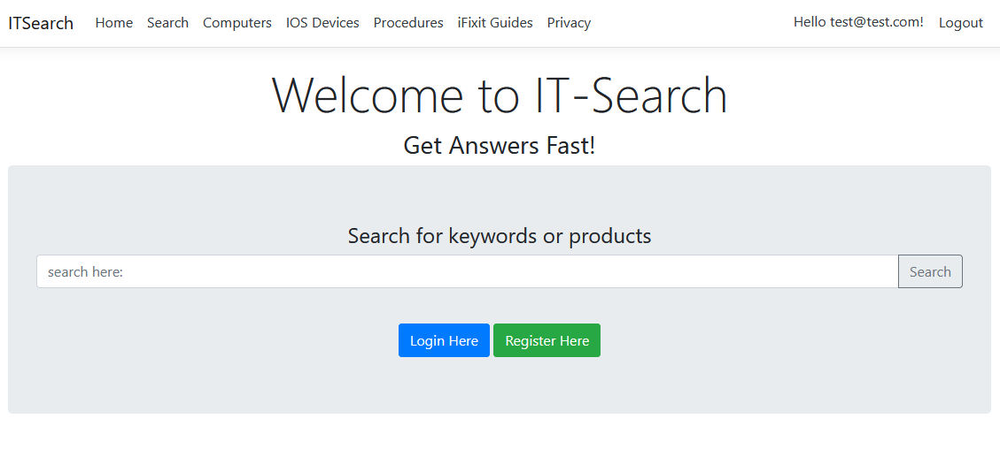
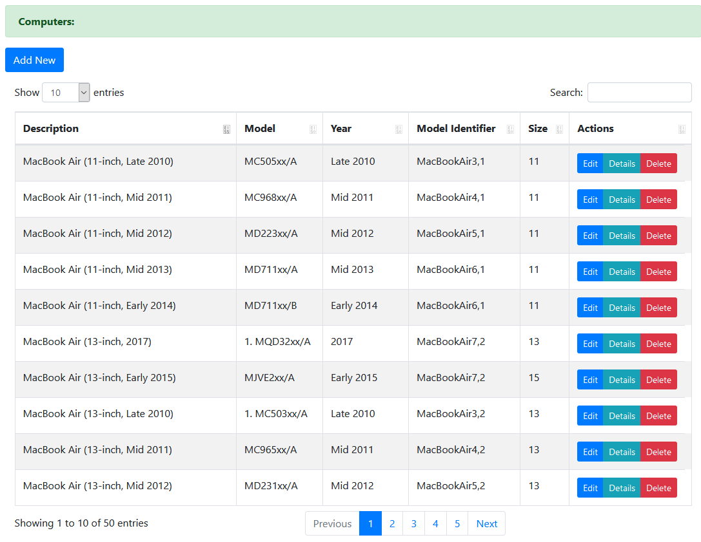
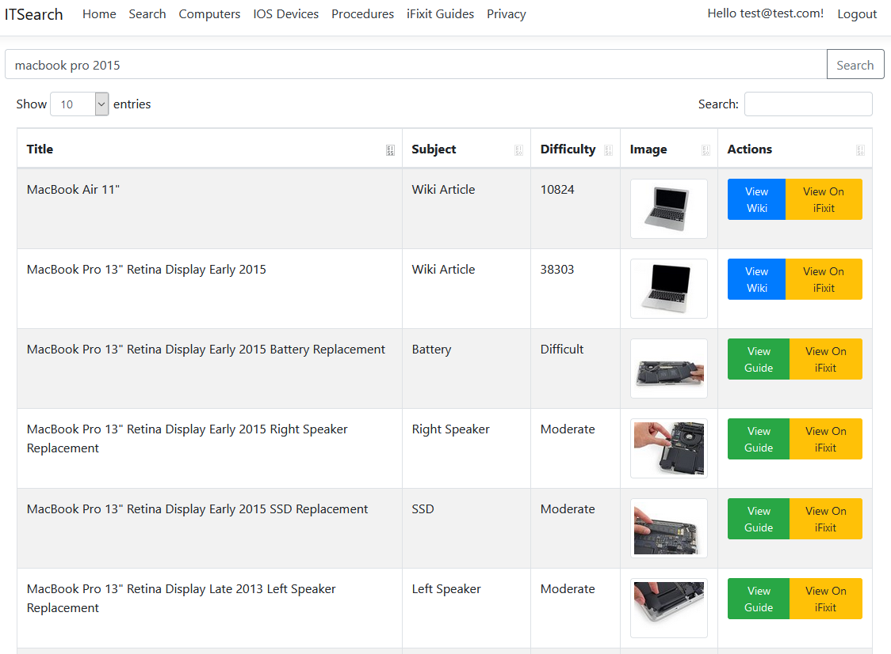
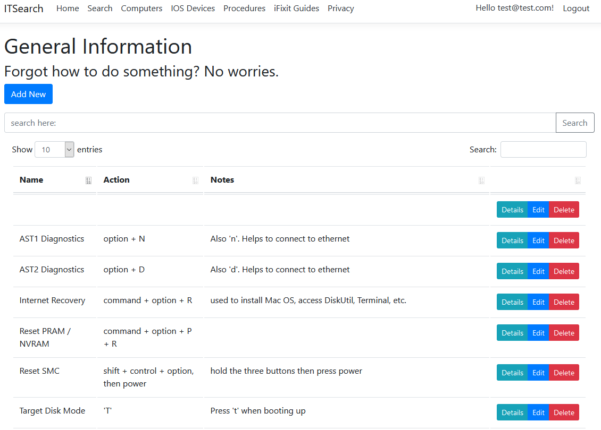

# IT-Search
 Quick search web app created for I.T. Worx.
 
 Link: (https://itsearch.azurewebsites.net/)
 
 Computer repair technicians have a lot of stuff they need to remember. Some of this is easily forgetable. We also use many resources to both diagnose and repair machines. After working in this industry for some time and becoming frustrated with the amount of browser tabs I had to keep open to switch back and forth between sites gathering information about a computer I was working on, I decided to create this website. This is meant to be an all-in-one lookup tool for repair technicians. 
 

 Powerful Searches

Relevant Results

Repair Guides and Wikis

Find Procedure Information

